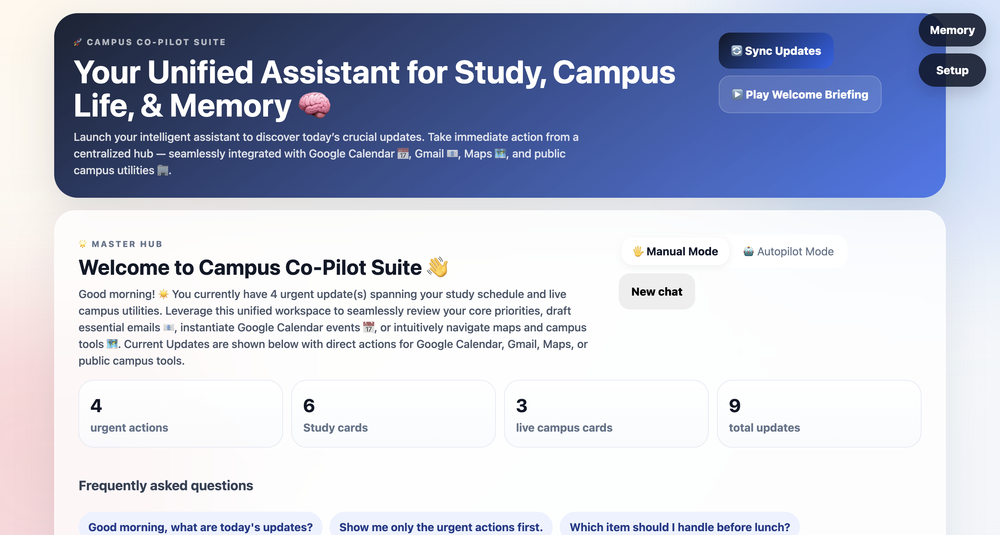
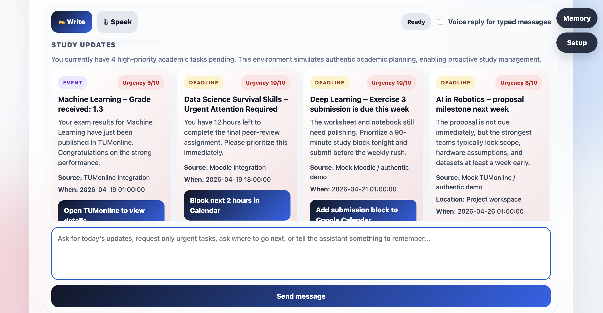
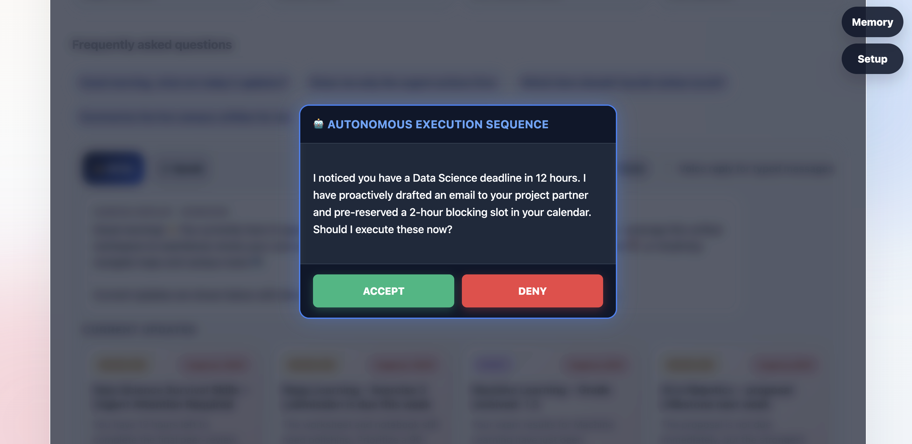

<div align="center">
  <h1>🎓 Campus Co-Pilot Suite — Unified Assistant Edition</h1>
  <p><em>An intelligent, unified conversational interface for seamless campus utility management.</em></p>
</div>

 <div align="center"></div>

 <div align="center"></div>

## 📖 Overview

The **Campus Co-Pilot Suite (Unified Assistant Edition)** revolutionizes campus utility interactions by transitioning from fragmented, multi-tab web interfaces into a **singular, highly cohesive assistant-first channel**. Under this paradigm, all campus utilities—ranging from dining menus to study session updates—are orchestrated directly through dynamic conversational flows rather than isolated dashboard widgets.

This repository features an elegant **React/Vite frontend** coupled with a high-performance **FastAPI backend**. It integrates state-of-the-art voice processing (ElevenLabs) and robust conversation orchestration (Dify), augmented by an adaptable local and remote memory system (Cognee).

## ✨ Key Features & Architectural Enhancements

- **Simulated Autonomous Execution (Autopilot)**: Features a robust autonomous execution workflow that requests semantic approval before executing massive cross-domain programmatic actions (e.g. Gmail & Google Calendar syncs).
- **Assistant-First Paradigm**: The primary dashboard directly loads into an immersive assistant workspace, eliminating navigational friction.
- **Multimodal Interaction**: Native support for both **text-based** typing and **voice-driven** queries, synchronized in real-time.
- **Contextual In-Stream Utilities**: Live data widgets (e.g., study updates, location maps) render gracefully *inside* the conversational flow, bypassing the need for context-switching.
- **Resilient Memory Management**: Operates seamlessly with a **local-by-default** memory engine, with a zero-config graceful degradation if the optional **Cognee** syncing is disabled or unavailable.

  

## 🛠 Tech Stack

- **Frontend**: React 18, Vite (for optimized builds and HMR).
- **Backend**: Python 3, FastAPI, Uvicorn (async execution).
- **LLM Orchestration**: [Dify](https://dify.ai/) (Utilizing standard Chatflows).
- **Voice Capabilities**: [ElevenLabs](https://elevenlabs.io/) (Handling STT & TTS).
- **Memory Persistence**: Built-in Local Engine + [Cognee](https://github.com/topoteretes/cognee) (Optional Graph/Vector Memory).

---

## 🚀 Getting Started: Local Implementation Guide

To implement and run this project professionally in a local environment, follow the steps below. The application operates via two discrete services: the FastAPI Python backend and the Vite Node.js frontend.

### Prerequisites
- **Python 3.9+** installed locally.
- **Node.js** (v18+ recommended) and `npm`.
- API Keys for **Dify** and **ElevenLabs** (Required for core functionality).
- Optional: API Keys for **Cognee** and **OpenAI**.

### 1. Backend Setup

The backend serves as the orchestration layer between the frontend client and third-party AI providers.

```bash
# Navigate to the backend directory
cd backend

# Initialize a Python Virtual Environment
python -m venv .venv

# Activate the Virtual Environment
# For Windows PowerShell:
.venv\Scripts\Activate.ps1
# For macOS / Linux:
source .venv/bin/activate

# Install core dependencies
pip install -r requirements.txt

# Configure environment variables
cp .env.example .env
```
*(Open `.env` in your editor and input your API keys for Dify, ElevenLabs, and Cognee).*

```bash
# Launch the backend via Uvicorn (Async ASGI server)
uvicorn main:app --reload --host 0.0.0.0 --port 8000
```
*The backend will now be active at `http://localhost:8000`. You can test its health at `http://localhost:8000/health`.*

### 2. Frontend Setup

The frontend provides the reactive UI/UX for the end-user.

```bash
# Open a new terminal session and navigate to the frontend directory
cd frontend

# Install necessary Node packages
npm install

# Configure environment variables
cp .env.example .env
```
*(Ensure `VITE_BACKEND_URL=http://localhost:8000` is appropriately set in `.env` if required).*

```bash
# Start the Vite development server
npm run dev
```
*The frontend will compile and mount at `http://localhost:5173`. Open this URL in a modern web browser to access the Unified Campus Assistant.*

---

## 🗺 Application Routing & Endpoints

### Client Routes (Frontend)
Located at `http://localhost:5173/`:
- `/#/` - **Main Assistant Interface**: The conversational entry point.
- `/#/memory` - **Memory Management Console**: Spawns in a new tab.
- `/#/setup` - **System Diagnostics & Setup**: Real-time integration API checks.

### Core API Contracts (Backend)
- `GET /api/copilot/home` - Returns aggregated initial campus data (Weather, Announcements).
- `POST /api/chat` - Ingests typed user input and returns Dify-orchestrated completions.
- `POST /api/voice-chat` - Ingests streaming audio blobes, transcribes via STT, process via Dify, and returns TTS synthesis.
- `GET /api/memory/list` - Retrieves historical conversational state.
- `POST /api/memory/remember` - Commits a distinct factoid/preference to persistent memory.
- `POST /api/memory/search` - RAG-style semantic search against stored memory.

---

## ⚙️ Third-Party Integration Context

To ensure seamless API communication, proper configuration of external providers is vital. Review these guidelines meticulously before deployment:

### Dify Configuration
- **Design Pattern**: Strictly utilize the **Chatflow** paradigm. Do **not** employ Workflows for the primary assistant logic, as the backend explicitly targets ongoing conversational persistence via `conversation_id`.
- **Memory Settings**: Ensure **LLM Memory is toggled ON** within the Dify studio.

### ElevenLabs Configuration
- Requires an active API key equipped with both **Speech-to-Text (STT)** and **Text-to-Speech (TTS)** quotas.
- Verify your `.env` contains a valid `ELEVENLABS_VOICE_ID` (e.g., standard conversational voices like `JBFqnCBsd6RMkjVDRZzb`) and that your model is set to `eleven_multilingual_v2` for linguistic versatility.

